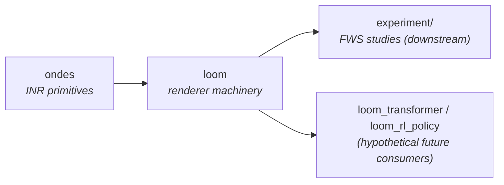

# `loom` — Public API Contract

> The 1415-line `experiment/experiment.py` monolith renders neural-
> network weights from a small implicit neural representation (INR).
> This document specifies the public contract of the `loom` package
> that replaces it.
>
> **Synthesis revision (2026-05-15, post-`ondes`-split).** This draft
> integrates the architect's original module decomposition with the
> contrarian's CRITIQUE.md, post-INR-split into `ondes` + `loom`. Where
> the two original drafts disagreed, the synthesis resolution is named
> inline. The CRITIQUE.md §1c transformer audit is now load-bearing on
> the `Target` protocol design (§2.7).

## 0. Library positioning

`loom` is a **reusable library** that owns weight-rendering machinery.
It depends on `ondes` (the upstream INR library — SIREN/H-SIREN/WIRE
bases and Fourier-feature encodings) and is peer to `samgria`,
`rltrain`, and `xptrack`. The specific experiment in
`experiment/experiment.py` is one consumer of `loom`, not its defining
use case.



### What `loom` owns

- The **renderer**: virtualisation, `render`, slots, leaf
  conditioning, polar orthogonalisation, FiLM modulation
- The **`Condition` value type** — composing basis × encoding × ortho
  × body capacity (the four axes)
- The **`Target` protocol** with overrideable weight-filter and per-
  axis coord semantics (the load-bearing extension point — §2.7)
- The **`TaskCfg` / `TaskData` types** as renderable contracts
- **Training primitives** — `train_multi_seed`, `RunResult`, optimiser
  groups, `clip_each_leaf`
- **Pluggable diagnostics** (§2.10), and the default two (cross-seed
  cosine, per-group grad norms)
- **Plotting helpers** that consume `RunResult` collections
- The **sweep primitive** — `cartesian_axes`, generated condition
  registries

### What `loom` does NOT own

- INR primitives (`BasisBody`, `Encoding`, `SIREN`/`HSIREN`/`WIRE`,
  Fourier encodings, `nyquist_sigma`) — **upstream in `ondes`**
- Concrete target architectures (`FCHeavyCNN`, `IrisMLP`,
  `ResidualConvNet`) — downstream demo
- Dataset loaders (`load_digits`, `load_iris`, `load_cifar10`) —
  downstream demo
- The pre-populated 25-row condition registry — downstream demo
- Runner scripts (`run_basin_study.py`, `run_followup_study.py`, …) —
  downstream demo

The "downstream demo" lives in a separate `experiment/` repo (peer to
`loom`, depends on `loom` + `ondes`). See §5.

### Dependencies

```toml
# loom/pyproject.toml
dependencies = [
    "jax",
    "jaxlib",
    "equinox",
    "optax",
    "jax-tqdm",
    "jaxtyping",
    "numpy",
    "matplotlib",
    "ondes",          # INR primitives — sibling library
]
```

No `scikit-learn`, no `torchvision` — those live downstream.

---

## 1. Anchoring vocabulary

The mathematical object loom realises is

```
W_eff(shape) = polar?( out_scale · ( body( γ(coords(shape)) ; FiLM ) − mean ) )
```

where

- `coords(shape)` is the **per-axis** coordinate grid over the weight
  tensor — produced by a `Target`-supplied `slot_axes(weight)` rule.
  Each axis carries its own semantics: continuous (the default,
  `linspace(-1, 1, k)`), categorical (no smoothness — averaged or
  one-hot), or log-spaced. The monolith hardcodes "continuous on every
  axis" via `_normalized_grid`; we lift that to the `Target` protocol
  so transformer position-bias tables can be rendered correctly.
- `γ` is an `ondes.Encoding`, applied per coordinate.
- `body` is an `ondes.BasisBody` — a stack of `ondes.BasisLayer`s
  (SIREN / H-SIREN / WIRE) with a scalar readout.
- `FiLM` is an optional per-leaf modulation tensor inside the body.
- `polar?` is the optional Björck–Bowie semi-orthogonal projection
  (rank-2 weights only).
- `out_scale` is the Kaiming-style target init magnitude (suppressed
  when `polar?` is active).

A **`Condition`** is a `(basis_spec, encoding_spec, ortho: bool, body_spec, topology)`
quintuple plus a sweep-identifier. **Body capacity is a first-class
axis** (CRITIQUE §3): the `body_spec` is a `BodySpec(hidden, layers, omega_first, omega_hidden, s_init)`
value type, not a hidden kwarg. The §11 capacity sweep is then a
`cartesian_axes` over the four (or five — including target) axes.

A **`Task`** is a `(template_fn, loader, …)` triple satisfying the
`TaskCfg` protocol. A **`Run`** is the result of training one
`Condition` × `Target` × `Task` triple across `num_seeds` seeds.

That decomposition is the spine of the module map.

---

## 2. Module map

Each `loom/<module>.py` owns one concept. Cross-module imports always
go *down* this list. No circular imports.

| module | owns | depends on |
|---|---|---|
| `loom.config` | `RendererConfig`, `TrainingConfig`, `MASTER_SEED` | — |
| `loom.ortho` | `polar_orthogonalise` | — |
| `loom.target` | `Target` protocol, `Axis` (per-leaf coord semantics), `BodySpec` value type, `default_weight_filter`, `is_weight` (default) | `config` |
| `loom.conditioning` | `LeafConditioning` (input head + FiLM around an `ondes.Encoding`) | `target`, `config`, `ondes` |
| `loom.slot` | `Slot` (unified — single type with optional per-leaf body), slot-construction helpers | `conditioning`, `target`, `ondes` |
| `loom.render` | `Renderer` protocol, `Shared` / `PerLeaf` / `Direct` renderers, `virtualize`, `render` | `slot`, `ortho`, `target`, `ondes` |
| `loom.condition` | `Topology`, `Condition` value type, `ConditionRegistry`, `cartesian_axes` (sweep helper) | `render`, `ondes` |
| `loom.task` | `TaskData`, `TaskCfg`, `TaskRegistry`, `LossFn`, `BatchFn` | `target` |
| `loom.diag` | `Diagnostic` protocol, default `cross_seed_cosine`, `group_grad_norms`, optimiser-group labelling | `render` |
| `loom.metrics` | `cross_entropy`, `accuracy`, `count_params` | — |
| `loom.train` | `RunResult`, `train_multi_seed`, `make_optimizer`, `clip_each_leaf` | `condition`, `task`, `diag`, `config` |
| `loom.plot` | `plot_loss`, `plot_test_acc`, `plot_grad_dynamics`, `plot_cross_seed_cos`, `summarize` | `condition`, `train` |

Compared to the original draft: `loom.basis` and `loom.encoding` are
gone — those types now live in `ondes`. `loom.targets` (concrete
classes) and `loom.tasks` (concrete loaders) never existed in the
narrowed-scope version; they're downstream.

**Synthesis decision on banner-as-module (CRITIQUE §2a):** the
monolith's "BASES" banner conflated body activation and input
encoding. After the `ondes` split, *both* live upstream as siblings —
`ondes.basis` and `ondes.encoding`. `LeafConditioning` (input head +
FiLM around an `Encoding`) is renderer-side because it owns the
per-leaf trainable head; it lives in `loom.conditioning`, not in
`ondes`.

### Why no `loom.presets` factory module

Numeric defaults are dataclass field defaults on `RendererConfig` /
`TrainingConfig`. The canned 25-row condition registry was demo
content (now downstream). No factory module is needed.

### `__init__.py` policy (synthesis of architect's "user constraint"
### vs CRITIQUE §2b "submodule imports")

**Resolution: curated narrow top-level surface.** The user explicitly
asked for `from loom import Condition, …` ergonomics. Contrarian's
risk (downstream import-break worry on internal refactors) is real but
manageable if we keep the top-level surface small and stable.

```python
# loom/__init__.py — curated, intentionally narrow.
from loom.condition import Condition, ConditionRegistry, Topology, cartesian_axes
from loom.target    import Target, BodySpec, Axis
from loom.task      import TaskCfg, TaskData
from loom.config    import RendererConfig, TrainingConfig
from loom.train     import train_multi_seed, RunResult
from loom.render    import render, virtualize
from loom.diag      import Diagnostic

__all__ = [
    "Condition", "ConditionRegistry", "Topology", "cartesian_axes",
    "Target", "BodySpec", "Axis",
    "TaskCfg", "TaskData",
    "RendererConfig", "TrainingConfig",
    "train_multi_seed", "RunResult",
    "render", "virtualize",
    "Diagnostic",
]
```

Internal helpers (`is_weight`, `siren_in_dim_for`, `target_init_scale`,
`LeafConditioning`, `Slot`, `Shared` / `PerLeaf` / `Direct` renderer
classes) are **not** re-exported. Consumers wanting them write
`from loom.slot import Slot`. That keeps the top-level contract small
enough to be stable across internal refactors. INR primitives
(`SIREN`, `HSIREN`, `WIRE`, `Gaussian`, etc.) come from `ondes` top
level, not `loom`'s.

---

## 3. Public API per module

For every name in `__all__`, one-line signature + one-line description.
Type annotations are part of the contract.

### 3.1 `loom.config`

```python
__all__ = ["RendererConfig", "TrainingConfig", "MASTER_SEED"]

MASTER_SEED: Final[int] = 42  # deterministic root key

@dataclass(frozen=True, slots=True)
class RendererConfig:
    """Renderer-side hyperparameters that are NOT axes of a Condition.

    Body sizing (hidden/layers/omega/s_init) is NOT here — it's on
    `BodySpec` (a Condition axis). What lives here is the orthogonal-
    projection iteration count and the gaussian-encoding feature
    count, both of which we never sweep over.
    """
    polar_iters: int = 12
    fourier_features: int = 16

@dataclass(frozen=True, slots=True)
class TrainingConfig:
    """Training-loop hyperparameters."""
    num_seeds: int = 5
    eval_every: int = 25
    per_leaf_grad_cap: float = 1.0
    slow_lr_mult: float = 0.1
```

**Synthesis note:** the architect's original draft put `hidden` /
`layers` / `omega_first` / `omega_hidden` / `s_init` on
`RendererConfig`. CRITIQUE §3 argues they belong on a `BodySpec` value
type carried by `Condition`. The synthesis adopts the CRITIQUE
position because the §11 capacity sweep makes body capacity an axis,
not a global hyperparameter — see §3.4 and §3.7. `RendererConfig` is
now genuinely small (the two knobs that *aren't* swept).

### 3.2 `loom.ortho`

```python
__all__ = ["polar_orthogonalise"]

def polar_orthogonalise(W: Float[Array, "m n"], *,
                        n_iter: int = 12) -> Float[Array, "m n"]:
    """Björck–Bowie polar iteration X ← X(3I − XᵀX)/2.
    Parameter-free; matmul-only autograd path; Frobenius-normalised
    input guarantees convergence."""
```

One function. Algorithm locked per 2026-05-15 CHANGELOG.

### 3.3 `loom.target`

```python
__all__ = ["Target", "Axis", "BodySpec", "TemplateFn",
           "default_weight_filter", "is_weight",
           "default_axes_for"]

class AxisKind(enum.Enum):
    CONTINUOUS  = "continuous"   # linspace(-1, 1, n) — default
    CATEGORICAL = "categorical"  # no smoothness; averaged
    LOGARITHMIC = "logarithmic"  # log-spaced grid

@dataclass(frozen=True, slots=True)
class Axis:
    """Per-tensor-axis coordinate semantics. Used by Target.slot_axes."""
    kind: AxisKind = AxisKind.CONTINUOUS
    n: int = 0                   # filled from weight.shape[axis] at render time
    lo: float = -1.0
    hi: float = 1.0

class Target(Protocol):
    """The structural contract for a target network.

    Two extension points beyond `__init__(*, key=...)` + `__call__(x)`:

      - `weight_filter() -> Callable[[Any], bool]` decides what
        tensors get rendered. Defaults to `default_weight_filter`
        (rank ≥ 2, ≥2 non-singleton dims).
      - `slot_axes(weight) -> tuple[Axis, ...]` decides the coord
        semantics PER AXIS of each renderable tensor. Defaults to
        `default_axes_for(weight)` which returns
        `(Axis(CONTINUOUS, n=k) for k in weight.shape)`.

    Most targets just inherit defaults. Transformer-position-bias
    tables override `slot_axes` to mark the heads-axis CATEGORICAL.
    Attention-renderer-experiment targets override `weight_filter`
    to opt rank-1 LayerNorm gammas in. No monkey-patching.
    """
    def __init__(self, *, key: PRNGKeyArray) -> None: ...
    def __call__(self, x: Array) -> Array: ...

    # Both defaulted by mixin or `@runtime_checkable` Protocol with
    # default implementations on a `TargetMixin` base class — see Q1.
    def weight_filter(self) -> Callable[[Any], bool]: ...
    def slot_axes(self, weight: Array) -> tuple[Axis, ...]: ...

TemplateFn = Callable[..., Target]
"""A template factory; usually a class, or a partial of one."""

@dataclass(frozen=True, slots=True)
class BodySpec:
    """Body-MLP spec — a Condition axis. Carries the args needed to
    construct an ondes.BasisBody at render time, so capacity sweeps
    (§11 of findings) are first-class.

    `basis_kind` matches the ondes.BASIS_KINDS tuple. Downstream
    consumers picking a different basis use this field.
    """
    hidden: int = 24
    layers: int = 2
    omega_first: float = 6.0
    omega_hidden: float = 1.0
    s_init: float = 3.0
    basis_kind: str = "siren"   # one of ondes.BASIS_KINDS

    def materialise(self, *, in_dim: int, key: PRNGKeyArray) -> "ondes.BasisBody":
        """Build an actual BasisBody from the spec."""

def default_weight_filter(x: Any) -> bool:
    """Rank ≥ 2 with ≥ 2 non-singleton dims (the monolith's rule)."""

def is_weight(x: Any) -> bool:
    """Convenience: `default_weight_filter(x)`."""

def default_axes_for(weight: Array) -> tuple[Axis, ...]:
    """Continuous axis per dimension; defaults to linspace(-1,1)."""
```

**Synthesis — CRITIQUE §1c integration.** The transformer audit
identified three concrete failures of the monolith's renderer
machinery: no per-target override for `_is_weight`, no per-leaf shape
semantics for mixed continuous/categorical axes, no coord-frame
override. All three are addressed by elevating `weight_filter` and
`slot_axes` to the `Target` protocol with sensible defaults. The
default case is bit-identical to today's behaviour; consumers override
only when they need to.

The `Axis(kind=CATEGORICAL)` semantics: the render path averages over
the categorical axis(es) so the rendered tensor has the right shape
but the renderer doesn't impose a smoothness prior on
permutation-symmetric dimensions.

**Open question Q1** (§7): exact Python mechanism — runtime-checkable
`Protocol` with default implementations, or an `eqx.Module`-aware
base class `TargetMixin` that subclasses inherit. Both work; I'd lean
mixin for ergonomics.

### 3.4 `loom.conditioning`

```python
__all__ = ["LeafConditioning"]

class LeafConditioning(eqx.Module):
    """Per-leaf input head + FiLM, parameterised by an ondes.Encoding.

    The Encoding is the upstream INR primitive (`ondes.gaussian_fixed`,
    `ondes.dyadic`, etc.). LeafConditioning composes it with a
    per-leaf head_W/head_b that projects the encoded coord into the
    body MLP's input dim, plus a per-leaf FiLM modulation tensor for
    the body layers.

    LeafConditioning lives in loom (not ondes) because it owns
    renderer-side trainable state. The Encoding it carries is from
    ondes.
    """
    encoding: "ondes.Encoding"
    head_W: Float[Array, "in_dim proj_in"]
    head_b: Float[Array, "in_dim"]
    film: Float[Array, "L two_h"]
    rank: int = eqx.field(static=True)

    def __init__(self, *, rank: int, siren_in_dim: int,
                 encoding: "ondes.Encoding", body_spec: BodySpec,
                 num_freqs: int = 16, key: PRNGKeyArray): ...
    def project(self, coord: Float[Array, "rank"]) -> Float[Array, "siren_in_dim"]: ...
```

The monolith's `LeafConditioning` had a string-discriminator
`encoding_kind` + always-present `fourier_B`/`sigma_learnable` fields
("kept for pytree uniformity"). After the `ondes` split that's gone:
the `Encoding` value object is from `ondes`, owns its own state, and
projects without an `if/elif` chain. Pytree uniformity is preserved
naturally because each consumer's `LeafConditioning` instance commits
to one `Encoding` subclass at construction time.

### 3.5 `loom.slot`

**Synthesis — CRITIQUE §2a slot unification, with the empirical-test
caveat (architect's concern).**

```python
__all__ = ["Slot", "siren_in_dim_for", "target_init_scale"]

class Slot(eqx.Module):
    """A virtualised weight leaf, rendered by either an external
    shared body OR a per-leaf private body.

      - `body is None` → shared-body topology (the shared body lives
        on the renderer, not the slot)
      - `body is not None` → per-leaf topology

    The previous `LeafSlot` / `PerLeafSlot` split (two near-identical
    types differing only in whether `body` is a field) collapses to
    one type with `body: ondes.BasisBody | None`. `_render_leaf`'s
    `isinstance` chain becomes a single `if slot.body is not None:`.
    """
    cond: LeafConditioning
    body: "ondes.BasisBody | None"
    in_dim: int = eqx.field(static=True)
    out_scale: float = eqx.field(static=True)
    shape: tuple[int, ...] = eqx.field(static=True)
    axes: tuple[Axis, ...] = eqx.field(static=True)
    ortho: bool = eqx.field(static=True)

def siren_in_dim_for(rank: int) -> int: ...        # max(4*rank, 4)
def target_init_scale(shape: tuple[int, ...]) -> float: ...
```

**Empirical test (architect's caveat, agreed):** the merged `Slot`
must walk cleanly through `render`, `_render_for_diagnostics`, and the
diagnostics-pytree-walk in `cross_seed_cosine` without needing any
renamed-field hack or discriminator. If any of those three needs a
hack, the synthesis falls back to separate `LeafSlot` / `PerLeafSlot`.
The implementer running the port will report the empirical outcome;
this section will be tightened to one type or the other based on
their result.

### 3.6 `loom.render`

```python
__all__ = ["Renderer", "Shared", "PerLeaf", "Direct",
           "virtualize", "render"]

class Renderer(Protocol):
    """Build-and-call protocol."""
    def init(self, template: Target, key: PRNGKeyArray) -> eqx.Module: ...
    def forward(self, params: eqx.Module, x: Array) -> Array: ...

class Direct(eqx.Module):
    """Identity renderer — train the target directly. (Direct baseline.)"""

class Shared(eqx.Module):
    """One ondes.BasisBody shared across all rendered leaves.
    The body is materialised from a BodySpec at init time."""
    body: "ondes.BasisBody"
    virt: eqx.Module
    use_film: bool = eqx.field(static=True)

class PerLeaf(eqx.Module):
    """Each rendered leaf carries its own ondes.BasisBody (lives on
    the Slot)."""
    virt: eqx.Module
    use_film: bool = eqx.field(static=True)

def virtualize(template: Target, *, encoding: "ondes.Encoding",
               body_spec: BodySpec, ortho: bool, topology: Topology,
               cfg: RendererConfig, key: PRNGKeyArray) -> Renderer:
    """Walk the target template using `template.weight_filter()`,
    replace renderable leaves with Slots (with per-axis semantics
    from `template.slot_axes(weight)`), and return the renderer.
    `body_spec` is materialised once for SHARED, per-leaf for PER_LEAF,
    and unused for DIRECT."""

def render(renderer: Renderer) -> eqx.Module:
    """Materialise the rendered weight pytree (the actual target with
    concrete weights)."""
```

`virtualize` is the single entry point — collapsing the monolith's
`make_shared` / `make_per_leaf` / implicit-direct trio. The
`topology: Topology` dispatch is what selects renderer type.

### 3.7 `loom.condition`

**Synthesis — CRITIQUE §3 body-as-axis is integrated.**

```python
__all__ = ["Topology", "Condition", "ConditionRegistry",
           "cartesian_axes"]

class Topology(enum.Enum):
    DIRECT = "direct"
    SHARED = "shared"
    PER_LEAF = "per_leaf"

@dataclass(frozen=True, slots=True)
class Condition:
    """A FOUR-AXIS sweep cell: (basis_kind, encoding, ortho, body) +
    a Topology + display metadata.

    Body capacity is a first-class axis: `body: BodySpec`. The §11
    capacity sweep is one cartesian_axes call away. Result-dict keys
    are stable via `id` (a structural hash of the four axes).
    """
    name: str
    color: str
    encoding: "ondes.Encoding"   # spec; carries the basis-kind config via BodySpec
    body: BodySpec
    ortho: bool = False
    topology: Topology = Topology.SHARED

    @property
    def id(self) -> str:
        """Stable hash of the four axes; usable as a dict key in a
        capacity-sweep result dict."""

    @classmethod
    def shared(cls, name: str, color: str, *,
               encoding: "ondes.Encoding" = None,   # default Identity-like
               body: BodySpec = BodySpec(),
               ortho: bool = False) -> "Condition": ...

    @classmethod
    def per_leaf(cls, name: str, color: str, *,
                 encoding: "ondes.Encoding" = None,
                 body: BodySpec = BodySpec(),
                 ortho: bool = False) -> "Condition": ...

    @classmethod
    def direct(cls, name: str, color: str) -> "Condition": ...

class ConditionRegistry(Mapping[str, Condition]):
    """Ordered, immutable mapping. `.select(keys)` / `.filter(pred)`
    return new registries. Downstream code builds its own; `loom`
    ships no canned instance."""
    def __init__(self, items: Iterable[Condition]): ...
    def select(self, keys: Iterable[str]) -> "ConditionRegistry": ...
    def filter(self, predicate: Callable[[Condition], bool]) -> "ConditionRegistry": ...

def cartesian_axes(**axes: Iterable[Any]) -> Iterator[dict[str, Any]]:
    """Cartesian product over named axes, yielding kwargs dicts.

    Usage:
        for kw in cartesian_axes(
            encoding=[gaussian_fixed(math.pi), dyadic(L=4)],
            body=[BodySpec(hidden=h) for h in (12, 16, 24, 48, 96)],
            ortho=[False, True],
        ):
            cond = Condition.shared(name=f"sweep-{...}", color="#000", **kw)
            res[cond.id] = train_multi_seed(cond, target, task, ...)

    The four-or-five-axis capacity-sweep loop becomes one cartesian_axes
    call (CRITIQUE §3 demand: target architecture is implicitly a sixth
    axis; same primitive handles it by passing `target=[...]` and
    threading through the call site).
    """
```

**Resolved synthesis points:**

- *Body-as-axis (CRITIQUE §3):* adopted. The architect's original
  `RendererConfig(hidden=48)` kwarg pattern works for capacity-only
  sweeps but doesn't generalise to `body_layers` + per-condition
  basis-kind variation. `BodySpec` carries all five body-parameters
  as one value type; `Condition` carries it as a field; `id` reflects
  it; sweep loops are clean.
- *Generated registry (CRITIQUE §3):* `cartesian_axes` is the
  primitive. `ConditionRegistry` is still the container, but
  downstream consumers build instances by passing the iterator
  through `ConditionRegistry([Condition(...) for kw in cartesian_axes(...)])`.
- *`Condition.id` stable hash:* solves the result-dict-keys problem
  CRITIQUE §3 raised. The monolith's string-key into a module-level
  `CONDITIONS` dict breaks the moment the sweep is Cartesian; `.id`
  is a structural hash that survives.
- *`color` on `Condition`:* architect's open question Q3 — still
  unresolved (presentation concern bleeding into the data model). I
  leave it on `Condition` to keep delta small; happy to split into
  `ConditionTheme` if pushed.

### 3.8 `loom.task`

```python
__all__ = ["TaskData", "TaskCfg", "TaskRegistry", "Loader", "LossFn",
           "BatchFn"]

@dataclass(frozen=True, slots=True)
class TaskData:
    """Classification-style train/test split. The MOST COMMON shape
    but not the only one — non-classification consumers use
    `BatchFn` (below) instead and don't construct TaskData."""
    xs_train: Float[Array, "n ..."]
    ys_train: Int[Array, "n"]
    xs_test: Float[Array, "m ..."]
    ys_test: Int[Array, "m"]
    name: str

Loader = Callable[[], TaskData]
"""Zero-arg → TaskData. Downstream code provides these for sklearn,
torchvision, huggingface, fsspec, synthetic, etc."""

LossFn = Callable[[Array, Array], Array]
"""(logits, labels) → scalar. Defaults to cross_entropy."""

BatchFn = Callable[[PRNGKeyArray], tuple[Array, ...]]
"""Per-step batch sampler — alternative to TaskData for non-classification
use cases. Returns a tuple consumed by the loss_fn. RL policy-renderer
consumers (per CRITIQUE §1d) use this path; they never construct TaskData."""

@dataclass(frozen=True, slots=True)
class TaskCfg:
    """A renderable task. Either supply a `loader` (classification path
    that yields TaskData) OR a `batch_fn` (general path) — not both."""
    name: str
    template_fn: TemplateFn
    num_steps: int
    batch_size: int
    lr: float
    loader: Loader | None = None
    batch_fn: BatchFn | None = None
    loss_fn: LossFn | None = None   # None → cross-entropy

    def __post_init__(self):
        assert (self.loader is None) != (self.batch_fn is None), \
            "Exactly one of loader/batch_fn must be set."

class TaskRegistry(Mapping[str, TaskCfg]):
    """Ordered, immutable, `.select` / `.filter`."""
```

**Synthesis — CRITIQUE §1d resolution.** Contrarian flagged that
`TaskData`'s classification shape (xs_train/ys_train/xs_test/ys_test)
bakes the classification convention into the library. They proposed
either making `TaskData` a protocol or dropping it entirely.

The synthesis takes a middle path: **keep `TaskData` as the common
classification convenience, but add `BatchFn` as the protocol-level
escape hatch**. `train_multi_seed` accepts both paths via the
`TaskCfg.loader xor batch_fn` discriminant. Classification consumers
keep today's ergonomics; RL/regression/policy-renderer consumers
supply a `batch_fn` and never construct `TaskData`. The library
doesn't ship dataset loaders either way (CRITIQUE §1d's other
demand).

### 3.9 `loom.diag`

**Synthesis — CRITIQUE §1e pluggable-diagnostics integration.**

```python
__all__ = ["Diagnostic", "cross_seed_cosine", "group_grad_norms",
           "label_param_group", "DEFAULT_DIAGNOSTICS"]

class Diagnostic(Protocol):
    """Per-eval-block diagnostic. Called with (params_stack, batch_args)
    and returns a scalar or shape-known array. Stacked into RunResult."""
    name: str   # column name in RunResult
    def __call__(self, params: Any, *batch_args: Any) -> Array: ...

# Default diagnostic implementations (the monolith's two):

class cross_seed_cosine(Diagnostic):
    """Mean off-diagonal cosine similarity between rendered weights
    across seeds, averaged over weight leaves. Same algorithm as
    `_cross_seed_cosine_scalar` (monolith lines 994–1019)."""

class group_grad_norms(Diagnostic):
    """Per-LR-group mean leaf grad norm. Groups are determined by
    `label_param_group`, which consults `Basis.slow_param_names()`
    (so a downstream Basis introducing a new slow-natured param
    routes correctly without editing a module-level SLOW_NAMES set —
    CRITIQUE §1a second-order benefit)."""

def label_param_group(path: PyTreePath, leaf: Any) -> str:
    """('main' | 'slow') based on path-entry names matching
    `slow_param_names()` from any Basis on the path. Falls back to
    a default set { 'omega', 's', 'sigma_learnable' } if no Basis is
    in scope."""

DEFAULT_DIAGNOSTICS: tuple[Diagnostic, ...] = (
    cross_seed_cosine(),
    group_grad_norms(),
)
```

**Note on slow-param machinery:** the monolith hardcodes
`SLOW_NAMES = {"omega", "s", "sigma_learnable"}` at module scope.
CRITIQUE §1a §"Second-order benefit" argues that a new `Basis`
should declare its own slow-param names rather than requiring an edit
to a `loom`-level constant. The synthesis adopts this: `Basis` (in
`ondes`) exposes `slow_param_names()`, and `loom.diag.label_param_group`
walks the path to find any active Basis. The default fallback
preserves today's behaviour for direct-target params that aren't
under a Basis path.

Coordination with `ondes`: the contract that `Basis` subclasses
implement `slow_param_names()` lives in `ondes/DESIGN.md`. Listed
here as a cross-library invariant.

### 3.10 `loom.metrics`

```python
__all__ = ["cross_entropy", "accuracy", "count_params"]

def cross_entropy(logits: Array, labels: Array) -> Array: ...
def accuracy(logits: Array, labels: Array) -> Array: ...
def count_params(tree: Any) -> int: ...
```

Self-explanatory; verbatim from the monolith.

### 3.11 `loom.train`

```python
__all__ = ["RunResult", "train_multi_seed", "make_optimizer",
           "clip_each_leaf"]

@dataclass(frozen=True, slots=True)
class RunResult:
    """Per-condition output. Shape notation: seeds, steps,
    n_eval = num_steps // eval_every."""
    losses: np.ndarray              # (seeds, steps)
    eval_curves: np.ndarray         # (seeds, n_eval, 2)  — train/test acc
    diagnostics: dict[str, np.ndarray]  # one entry per active Diagnostic
    n_params: int
    condition: Condition            # CRITIQUE §3: RunResult knows its Condition

def train_multi_seed(
    cond: Condition,
    target: Target,
    task: TaskCfg,
    *,
    renderer_cfg: RendererConfig = RendererConfig(),
    training_cfg: TrainingConfig = TrainingConfig(),
    diagnostics: tuple[Diagnostic, ...] = DEFAULT_DIAGNOSTICS,
    master_seed: int = MASTER_SEED,
) -> RunResult: ...

def make_optimizer(lr: float, training_cfg: TrainingConfig
                   ) -> optax.GradientTransformation: ...
def clip_each_leaf(max_norm: float) -> optax.GradientTransformation: ...
```

**Synthesis points integrated:**

- `cond: Condition` carries `BodySpec` directly; capacity sweep is
  trivial.
- `target: Target` is a separate argument from `task: TaskCfg`. The
  monolith's `template_fn` lived on `TaskCfg`; CRITIQUE §3's "target
  is implicitly a sixth axis" demand says target should be promoted
  to a top-level sweep dimension. Pulling it out of `TaskCfg` makes
  `(target, cond)` Cartesian products natural.
- `diagnostics: tuple[Diagnostic, ...]` is the CRITIQUE §1e
  pluggable-diagnostics path. The default tuple matches today's
  behaviour bit-identically; consumers add their own without forking
  the training loop.
- `RunResult.condition` lets the plotting code answer "which axis
  varied for this row?" — CRITIQUE §3's third demand.

### 3.12 `loom.plot`

```python
__all__ = ["plot_loss", "plot_test_acc", "plot_final_bars",
           "plot_grad_dynamics", "plot_cross_seed_cos", "summarize"]

def plot_loss(results: Mapping[str, RunResult],
              registry: ConditionRegistry, ax=None): ...
def plot_test_acc(results: Mapping[str, RunResult],
                  registry: ConditionRegistry, ax=None): ...
# … etc.
def summarize(results: Mapping[str, RunResult],
              registry: ConditionRegistry,
              target_params: int) -> pd.DataFrame: ...
```

**Synthesis — CRITIQUE §5 module sketch:** monolith's monolithic
`plot()` and `summarize()` decompose into one function per chart.
Each takes a `ConditionRegistry` explicitly (no module-level
`CONDITIONS` reach-in) and a `Mapping[str, RunResult]` keyed by
`cond.id`. The `DYNAMICS_CONDITION_SUBSET` module-level constant goes
away — callers pass `registry.select([...])` to narrow.

---

## 4. Killing the globals — explicit treatment

| Monolith global | Replacement | Where it lives |
|---|---|---|
| `SIREN_HIDDEN`, `SIREN_LAYERS`, `OMEGA_FIRST`, `OMEGA_HIDDEN`, `S_INIT` | `BodySpec` fields on Condition | `loom.target` (BodySpec) |
| `polar_iters`, `num_freqs` knobs | `RendererConfig` field defaults | `loom.config` |
| `NUM_SEEDS`, `EVAL_EVERY`, `LR_MULT`, `PER_LEAF_GRAD_CAP` | `TrainingConfig` field defaults | `loom.config` |
| `SLOW_NAMES = {…}` | `Basis.slow_param_names()` (in `ondes`) + library-side fallback | `ondes.basis` + `loom.diag` |
| `BASIS_KINDS` | `ondes.BASIS_KINDS` (preserved verbatim by the porter) | `ondes` |
| `CONDITIONS: dict[…]` (mutable) | `ConditionRegistry` *type* in `loom`; canned content downstream | `loom.condition` (type), `experiment/conditions.py` (instance) |
| `TASKS: list[…]` | `TaskRegistry` *type* in `loom`; canned content downstream | `loom.task` (type), `experiment/tasks.py` (instance) |
| `MASTER_SEED = 42` | `Final[int]` | `loom.config` |
| `_CIFAR_CACHE` | `functools.lru_cache` on downstream loader | `experiment/tasks.py` |
| `GROUP_ORDER`, `LR_MULT` | `TrainingConfig` derived | `loom.config` |
| `DYNAMICS_CONDITION_SUBSET` | Caller-supplied `registry.select(...)` | downstream scripts |
| `FCHeavyCNN`, `IrisMLP`, `ResidualConvNet`, `DigitsCNN`, … | Concrete `eqx.Module`s satisfying `Target` protocol | `experiment/targets.py` |
| `load_digits`, `load_iris`, `load_cifar10` | Concrete `Loader` callables | `experiment/tasks.py` |
| `DigitsDeepCNN` etc. | `functools.partial` of the above | `experiment/targets.py` |

The probe scripts' `try: CONDITIONS["x"] = ...; finally: CONDITIONS["x"] = old`
pattern is structurally impossible after the refactor (the registry
is immutable).

The capacity sweep (the demonstration that this design earns its
keep):

```python
import math
from ondes import gaussian_fixed, dyadic
from loom import (Condition, BodySpec, cartesian_axes,
                  RendererConfig, TrainingConfig, train_multi_seed)
from experiment.targets import DigitsCNN
from experiment.tasks   import digits_task

results = {}
for kw in cartesian_axes(
    encoding=[gaussian_fixed(math.pi), dyadic(L=4)],
    body=[BodySpec(hidden=h) for h in (12, 16, 24, 48, 96)],
    ortho=[False, True],
):
    cond = Condition.shared(
        name=f"sweep-{kw['body'].hidden}-{kw['ortho']}",
        color="#fb8072", **kw,
    )
    results[cond.id] = train_multi_seed(
        cond, DigitsCNN(key=...), digits_task,
        renderer_cfg=RendererConfig(),
        training_cfg=TrainingConfig(),
    )
```

§11 capacity-sweep requirement, satisfied: body capacity is an axis
value, not a global. Adding `body_layers` as a varied parameter is one
line in the `body=[…]` list. Adding the target as a sixth axis is
one more `cartesian_axes` argument.

---

## 5. Migration strategy

**Recommended:** port-then-shim per machinery module, with a
deferred-with-capacity-kwarg phase 0 to land the capacity sweep before
locking the library shape.

This is the synthesis of architect's "decompose-now bottom-up" and
CRITIQUE §4 option 2 ("run the capacity sweep first, then decompose
with empirical pressure applied").

### Phase 0 — capacity-kwarg in the monolith (~5 lines)

Add `body_hidden` and `body_layers` as kwargs on `shared_condition` in
the monolith. Run the §11 capacity sweep against the monolith — one
afternoon's CPU time, no library changes. The empirical answer
(curve flat? knee at 10%? knee at 5%?) shapes our confidence that
`BodySpec` is the right axis shape. Concretely: if the curve has no
knee, body capacity is genuinely an axis worth sweeping; if it does,
the knee informs the `BodySpec` defaults the library ships with.

This phase is small enough that team-lead/user could even skip it —
the architecture survives either way, the kwarg approach in the
monolith is throwaway. I name it because CRITIQUE §4 raised the
question and the answer informs no contentious downstream decisions.

### Phase 1 — port machinery bottom-up

In dependency order:

1. `loom.ortho` (one function, no deps)
2. `loom.config` (dataclasses)
3. `loom.target` (`Target` protocol, `Axis`, `BodySpec`,
   `default_weight_filter`, `default_axes_for`)
4. `loom.conditioning` (`LeafConditioning` — depends on `ondes.Encoding`)
5. `loom.slot` (`Slot` unified type, per §3.5 empirical test)
6. `loom.render` (`virtualize`, `render`, renderer classes)
7. `loom.condition` (`Condition`, `ConditionRegistry`, `cartesian_axes`)
8. `loom.task` (`TaskData`, `TaskCfg`, `BatchFn`)
9. `loom.diag` (`Diagnostic`, defaults; coordinates with
   `Basis.slow_param_names()` in `ondes`)
10. `loom.metrics`
11. `loom.train` (`train_multi_seed`, `RunResult`)
12. `loom.plot`

Each module ships with its own tests. Renderer composition has
integration tests against monolith output on `master_seed=42`
(bit-identical-RunResult criterion).

`experiment/experiment.py` becomes a re-export shim after each module
ports, so existing runner scripts keep working unchanged during the
migration.

### Phase 2 — migration-finale PR

- Delete `experiment/experiment.py` (the shim).
- Split monolith content into `experiment/targets.py`,
  `experiment/tasks.py`, `experiment/conditions.py`.
- `experiment/` becomes a separate repo depending on `loom` + `ondes`.

**Recommendation: `experiment/` is a separate repo.** Matches
`samgria` / `rltrain` / `xptrack` / now-`ondes` pattern. Reasons:
dependency-boundary clarity (sklearn/torchvision in experiment;
JAX/Equinox/Optax in loom), independent release cadence, future-
proofing for `loom_transformer` / `loom_rl_policy` consumers.

### Phase 3 — `loom/examples/`

Two or three tiny canonical demos using synthetic data, NOT the FWS
studies:

- `examples/render_one_weight.py` — virtualise a single `eqx.nn.Linear`,
  render it.
- `examples/capacity_sweep_synthetic.py` — the §11 sweep on a toy MLP
  with random data; demonstrates `cartesian_axes`.
- `examples/custom_target.py` — define a target with a non-default
  `slot_axes` (the transformer-position-bias case from CRITIQUE §1c).

These are docs-as-code, not experiments.

The migration owns one Trello card per ported module. Phase 0
through 3 are separate cards.

---

## 6. Things explicitly NOT changed

Locked-in invariants this design preserves:

- **JAX / Equinox / Optax stack.** No PyTorch, no Flax, no NNX.
- **`ondes.BasisBody` is an `eqx.Module`** with the field shape from
  the monolith (preserved by the porter).
- **`polar_orthogonalise` algorithm.** Björck–Bowie 12-iteration loop,
  Frobenius-normalised input, no SVD fallback.
- **`master_seed=42` determinism contract.** Identical seed →
  identical `RunResult` byte-for-byte.
- **The `(seeds, steps)` / `(seeds, n_eval, 2)` array shapes in
  `RunResult` for `losses` and `eval_curves`.** Downstream analysis
  depends on these.
- **`scan_tqdm` on the outer block-scan** for progress reporting.
- **"Subtract per-coord mean before applying `out_scale`"** — load-
  bearing for matching symmetric-uniform init in expectation.
- **The default `is_weight` rule** (≥ 2 non-singleton dims, the
  monolith's `_is_weight`). Targets can override via `weight_filter`.

---

## 7. Open questions

1. **Mechanism for `Target` protocol defaults.** Runtime-checkable
   `Protocol` with default implementations, or an `eqx.Module`-based
   `TargetMixin`? Both work. I lean mixin for ergonomics — concrete
   target classes inherit `TargetMixin` and only override
   `weight_filter` / `slot_axes` if they need to. Need a static check
   that downstream `eqx.Module` MRO plays nicely with the mixin.

2. **`Condition.color` field.** Presentation concern bleeding into the
   data model (architect's original Q3). Either keep on `Condition`
   to keep the migration delta small, or split into
   `ConditionTheme: Mapping[str, str]` in `loom.plot`. CRITIQUE
   didn't push back; I'd keep it unless asked to split.

3. **`pandas` dependency for `summarize`.** Returning a DataFrame is
   cleaner than printing, but pulls pandas in. Alternative: return a
   list of dataclass-typed rows.

4. **Should the historical condition-key naming convention** (`shared-si`,
   `shared-hs+ff-pi`, …) be documented in `loom`'s examples? The library
   never instantiates those names — they're a downstream convention. I'd
   mention them in `experiment/conditions.py`'s docstring but not in
   `loom`.

5. **Phase 0 capacity-sweep — do we run it before locking the library
   shape?** CRITIQUE §4 strongly favours yes. Architect originally
   favoured no but converged on yes-as-cheap-insurance during the
   pre-synthesis cross-talk. Open to team-lead/user discretion.

6. **`Topology` enum vs polymorphic renderer constructors.** Architect
   chose enum, CRITIQUE didn't push back. Sticking with enum unless
   the implementation phase shows the `if topology == ...` dispatch
   getting unwieldy.

7. **`Basis.init_params` returning a tuple of scalars** (now in
   `ondes`, not `loom`). The pytree-uniformity invariant
   (`omega`+`s` always carried) versus per-Basis-typed params.
   Punted to `ondes/DESIGN.md`.

---

## 8. Sanity-check — single-page consumer surface

The library's positioning claim: downstream work writes ~20 lines of
glue plus the sweep loop, not a fork. Here it is.

### 8a. Bring your own target + dataset (minimum path)

```python
import math
import equinox as eqx
import jax.numpy as jnp
from jaxtyping import Array, PRNGKeyArray
from sklearn.datasets import load_digits as sk_load_digits
from sklearn.model_selection import train_test_split

from ondes import gaussian_fixed
from loom  import (
    Condition, BodySpec, Target,
    TaskCfg, TaskData,
    train_multi_seed, RendererConfig, TrainingConfig,
)

class MyTarget(eqx.Module):
    # any eqx.Module taking key=...; default weight_filter and slot_axes apply
    def __init__(self, *, key: PRNGKeyArray): ...
    def __call__(self, x: Array) -> Array: ...

def my_loader() -> TaskData:
    d = sk_load_digits()
    X = (d.data.astype("float32") / 16.0).reshape(-1, 1, 8, 8)
    Xtr, Xte, ytr, yte = train_test_split(X, d.target.astype("int32"),
                                          test_size=0.2, random_state=0,
                                          stratify=d.target)
    return TaskData(jnp.asarray(Xtr), jnp.asarray(ytr),
                    jnp.asarray(Xte), jnp.asarray(yte), "digits")

cond = Condition.shared(
    name="siren+ff-pi", color="#1b9e77",
    encoding=gaussian_fixed(math.pi),
    body=BodySpec(hidden=48, layers=2),     # capacity is a Condition axis
)
task = TaskCfg("digits", template_fn=MyTarget, loader=my_loader,
               num_steps=1500, batch_size=128, lr=3e-3)
res = train_multi_seed(cond, MyTarget(key=...), task)

print(f"{res.n_params=}, test_acc={res.eval_curves[:, -1, 1].mean():.3f}")
```

### 8b. Cartesian capacity sweep — the §11 motivating use case

```python
from ondes import gaussian_fixed, dyadic
from loom  import (Condition, BodySpec, cartesian_axes,
                   train_multi_seed)
# `MyTarget`, `my_loader`, etc. from §8a

results = {}
for kw in cartesian_axes(
    encoding=[gaussian_fixed(math.pi), dyadic(L=4)],
    body=[BodySpec(hidden=h) for h in (12, 16, 24, 48, 96)],
    ortho=[False, True],
):
    cond = Condition.shared(
        name="-".join(f"{k}={getattr(v,'hidden',v)}" for k, v in kw.items()),
        color="#fb8072", **kw,
    )
    results[cond.id] = train_multi_seed(cond, MyTarget(key=...), task)
```

### 8c. Custom Target — the transformer-position-bias case (CRITIQUE §1c)

```python
import equinox as eqx
from loom import Target, Axis, AxisKind

class AttentionRendererTarget(eqx.Module):
    # ... whatever transformer-flavoured structure you like
    def __init__(self, *, key): ...
    def __call__(self, x): ...

    def slot_axes(self, weight):
        if weight.shape == (num_buckets, num_heads):  # position-bias table
            return (Axis(kind=AxisKind.CONTINUOUS, n=num_buckets),
                    Axis(kind=AxisKind.CATEGORICAL, n=num_heads))
        # everything else: default Cartesian-continuous grid
        from loom.target import default_axes_for
        return default_axes_for(weight)
```

Three lines of override to render a transformer's position-bias table
correctly — no monkey-patch on `_is_weight`, no fork. The
`AxisKind.CATEGORICAL` value tells the renderer not to impose a
coord-smoothness prior on the heads dimension. This is the
scope-claim test from CRITIQUE §1c.

No globals. No mutations. No `kind=` strings. Body capacity is a
first-class axis. Adding a new target or dataset is a class and a
function. Adding a new diagnostic is one `Diagnostic` subclass passed
through `train_multi_seed(..., diagnostics=...)`. Adding a new
renderable architecture is `slot_axes` override.

---

**End of contract.**
